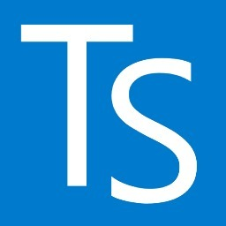
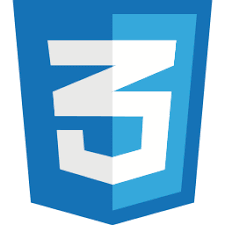
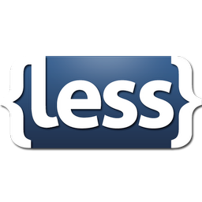
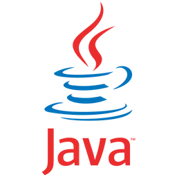
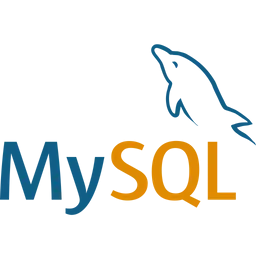
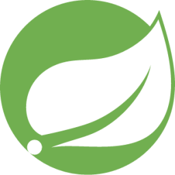

#                   **FRON-PROYECTO**
        


---

El proyecto utiliza el framework Svelte para el frontend y Spring Boot para el backend, con funcionalidades de validación de usuarios y emisión de tokens para el acceso al dashboard. El backend está diseñado para manejar diversos procesos administrativos, integrando Spring Boot con Spring Data JPA para la gestión de datos, MySQL como sistema de base de datos, y Spring Security para la seguridad, con Maven como herramienta de gestión de dependencias y construcción.


## Integrantes:

- Sara Lucia Lozano Rueda
- Juan Jose Basto Gonzalez
- Johan Alexander García Campos

  
# Backend

```bash
mysql -u "usuario-de-la-base" -p
"contraseña-de-la-base"

#Antes de ejecutar se debe de crear la base de datos
Create database jpa_project;
```

## Requisitos Previos

- Java 8 o superior

- Maven 3.6.3 o superior

- MySQL 5.7 o superior

- Crear la base de datos llamada jpa_project

## Tecnologías Utilizadas

- **Spring Boot**: Framework principal para la aplicación.
- **Spring Data JPA**: Para la gestión de datos y mapeo objeto-relacional.
- **MySQL**: Base de datos relacional.
- **Spring Security**: Para la gestión de autenticación y autorización.
- **Maven**: Herramienta de gestión de dependencias y construcción del proyecto.


# Front

# Requisistos

- Instlacion de la extencion Svelte for vs code
- Less: para estilos
- axios: para hacer peticiones al api

### Frontend Svelte (TypeScript + JavaScript + HTML + CSS +  Lees)

```bash
#Para poder ejecutar el progrma pasar estos comandos 
curl -o- https://raw.githubusercontent.com/nvm-sh/nvm/v0.39.3/install.sh | bash

export NVM_DIR="$HOME/.nvm"
[ -s "$NVM_DIR/nvm.sh" ] && \. "$NVM_DIR/nvm.sh"  # Esto carga nvm
[ -s "$NVM_DIR/bash_completion" ] && \. "$NVM_DIR/bash_completion"  # Esto carga la finalización de bash para nvm

nvm --version

nvm install --lts

nvm use --lts

node -v
npm install
npm install axios
npm install -D less

#comando para crear un nuevo proyecto
npm init vite primer-svelte --template svelte
cd primer-svelte


# Para iniciar el frontend
npm run dev
```

## Credenciales de Login

- http://localhost/8091/auth/register
- Metodo Post

Las credenciales se pueden cambiar desde insomnia

```json
{
  "username": 'usuario',
  "password": 'password123',
    "role":"ADMIN"
}
```

---

